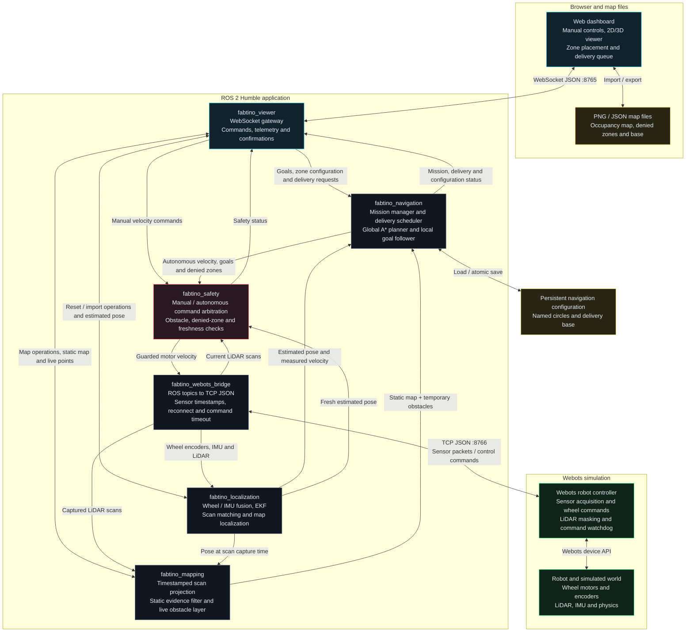

# Fabtino Robot Navigation System

Fabtino combines a browser dashboard, ROS 2 Humble packages, and a Webots robot
simulation. Operators can drive manually, build or import a map, define denied
zones, and run delivery tasks with arrival delays and a return to base.

## High-level Software Architecture Diagram



Connections inside the ROS boundary represent ROS topics and operation
confirmations. The browser connects to the gateway rather than to the robot
controller. All manual and autonomous motor commands pass through the safety
supervisor before reaching Webots. Ground-truth pose is available for diagnostics;
navigation uses the estimated pose.

## Component responsibilities

| Component | Responsibility | Source |
| --- | --- | --- |
| Dashboard | Manual driving, map display, import/export, circle placement, base selection and delivery controls | [HTML](map_viewer2_modular.html), [JavaScript](js/) |
| Viewer gateway | WebSocket commands and telemetry; coordinated map/reset confirmations | [fabtino_viewer](ros_ws/src/fabtino_viewer/) |
| Localization | Timestamped wheel/IMU fusion, EKF, LiDAR scan matching and imported-map localization | [fabtino_localization](ros_ws/src/fabtino_localization/) |
| Mapping | World-frame scan projection, stable-point confirmation, static occupancy and temporary navigation obstacles | [fabtino_mapping](ros_ws/src/fabtino_mapping/) |
| Mission manager | Goals, exploration, zone/base configuration, ordered delivery stops, delays and base return | [mission_manager_node.py](ros_ws/src/fabtino_navigation/fabtino_navigation/mission_manager_node.py) |
| Global planner | A* routes around occupied cells and circular denied zones, including robot clearance | [global_planner_node.py](ros_ws/src/fabtino_navigation/fabtino_navigation/global_planner_node.py) |
| Local planner | Route following, final position/orientation adjustment and settled arrival detection | [local_planner_node.py](ros_ws/src/fabtino_navigation/fabtino_navigation/local_planner_node.py) |
| Safety supervisor | Command arbitration, sensor/command freshness, proximity stops and swept-motion zone checks | [fabtino_safety](ros_ws/src/fabtino_safety/) |
| ROS/Webots bridge | Timestamped sensor transport, motor commands, scan/reset actions and reconnection | [fabtino_webots_bridge](ros_ws/src/fabtino_webots_bridge/) |
| Webots controller | Reads simulated devices, applies wheel commands and enforces its command watchdog | [Controller](webots/controllers/fabtino_webots_bridge_controller/) |
| Shared core | Reusable geometry, localization algorithms, occupancy/A*, static-point filtering, zone geometry and delivery transitions | [fabtino_core](ros_ws/src/fabtino_core/) |
| Bringup | Starts and configures the ROS nodes | [fabtino_sim.launch.py](ros_ws/src/fabtino_bringup/launch/fabtino_sim.launch.py) |

## Main workflows

1. **Mapping:** Webots sensors → TCP bridge → timestamped localization → scan
   projection. Returns enter the static map only after more than 3 seconds of
   stable world-frame observations. Current returns immediately populate a
   temporary obstacle layer for navigation.
2. **Navigation:** Dashboard goal → mission manager → A* route → local goal
   follower → safety supervisor → bridge → wheel controller. Estimated pose
   and current obstacles continuously feed the control loop.
3. **Denied zones and deliveries:** The mission manager owns named circular
   zones and the base. Planners and safety enforce the exclusions with robot
   clearance. Each delivery stop selects the closest reachable safe approach,
   waits after a settled arrival, then advances to the next task. Return to base
   is enabled by default.
4. **Map import and reset:** The gateway coordinates request IDs and completion
   messages across localization, mapping and the mission manager. Imported
   annotations are committed after localization succeeds. Odometry reset clears
   zones and base because the coordinate frame changes.

PNG metadata and JSON bundles preserve the map scale, zones and base. The launch
also persists navigation configuration at
`~/.local/share/fabtino/navigation.json`. Delivery queues do not automatically
resume after restart.

## Run and validate

Target runtime: Ubuntu 22.04 with ROS 2 Humble and Webots. The dashboard is served
over HTTP on port 8000; the gateway uses WebSocket port 8765, and the Webots
controller listens for the ROS bridge on TCP port 8766.

```bash
bash build_ros2.sh
bash run_full_project.sh
```

Open `http://127.0.0.1:8000/map_viewer2_modular.html`.

```bash
# Isolated package suites and portable realtime TCP/WebSocket pipeline.
python3 tests/run_validation.py --package all

# Also run the dashboard workflows in Chrome.
python3 tests/run_validation.py --package all --browser

# Genuine DDS/Webots checks against an already-running simulation.
python3 tests/live_pipeline.py --delivery-json tests/fixtures/delivery.json
```

Portable tests explicitly substitute ROS topics and robot devices while using
real network transports. The live test requires genuine ROS/Webots; adjust its
delivery fixture to the active world and map frame. See
[setup, behavior and test instructions](README_ROS2_HUMBLE.md) for dependencies
and details, and [validation results](tests/results/package_validation.json)
for the latest completed suites.
